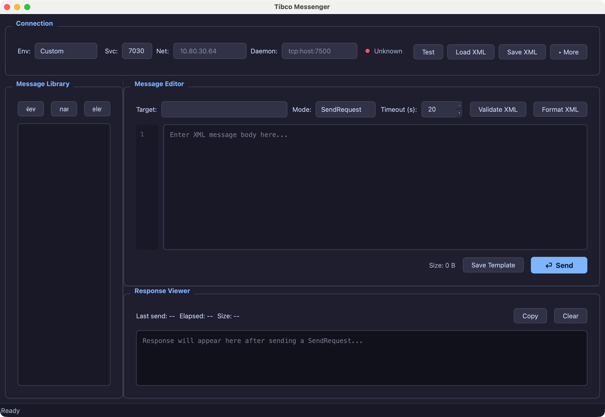

# Tibco Messenger

> macOS 桌面工具 — Tibco Rendezvous 消息发送与测试

一个原生的 macOS 桌面应用，用于发送 Tibco RV 消息、管理消息模板、查看响应。专为 MES / 半导体 Fab 场景设计，也适用于任何使用 Tibco Rendezvous 的系统。

## 界面预览



## 功能

- **图形化消息发送** — Send（只发）和 SendRequest（请求-响应）两种模式
- **连接配置管理** — 支持 Service / Network / Daemon / Subject 全参数配置，一键测试连通性
- **环境预设** — 内置 DEV / TEST / PRD 环境模板，支持 JSON 自定义
- **config.xml 兼容** — 可直接加载和保存项目中的 `config.xml` 配置文件
- **消息模板库** — 保存常用消息，双击加载，支持增删改
- **XML 编辑器** — 语法高亮、行号、格式化、校验
- **响应查看器** — 格式化 XML 显示，含耗时和大小统计
- **命令行支持** — `--config` 加载配置，`--light` 浅色主题
- **离线模式** — 未安装 Tibco 库时仍可编辑消息模板

## 系统要求

| 组件 | 说明 |
|------|------|
| macOS | 12+ (Monterey 及以上) |
| Tibco Rendezvous | 8.x，安装在 `/opt/tibco/tibrv/` |
| Java (SendRequest 模式) | JDK 17 x86_64，用于 Tibco Java 原生库 |
| Python (开发模式) | 3.9+，仅开发/源码运行时需要 |

> **Apple Silicon 用户**：Tibco RV 库是 x86_64，Send 模式通过 Rosetta 2 运行。SendRequest 模式需要 x86_64 JDK（如 `jdk-17.0.17.x64`）。

## 安装

### 方式一：下载 DMG

从 [Releases](https://github.com/your-org/tibco-messenger/releases) 下载 `TibcoMessenger-x.x.x.dmg`，双击挂载后拖入 Applications。

首次打开：右键 → 打开（因未签名需手动确认一次）。

### 方式二：源码运行

```bash
git clone https://github.com/your-org/tibco-messenger.git
cd tibco-messenger
pip install -r requirements.txt
python main.py
```

## 使用

### 启动

```bash
# 暗色主题（默认）
python main.py

# 浅色主题
python main.py --light

# 启动时加载配置
python main.py --config /path/to/config.xml
```

### 配置连接

1. 顶部 **Env** 下拉选择预设环境，或手动填写 Svc / Net / Daemon
2. 点击 **Test** 验证连接，左侧圆点变绿即连接成功
3. 点击 **▸ More** 展开高级配置（Subject、Timeout、Encoding 等）
4. 也可通过 **Load XML** 直接加载项目中的 `config.xml`

### 发送消息

1. 在右侧编辑区输入 XML 消息体（**不需要** `<?xml?>` 声明）
2. Target 会自动填入 Connection 中配置的默认 Subject
3. 选择 Mode：`SendRequest`（等待回复）或 `Send`（只发）
4. 点击 **⏎ Send** 或按 `Cmd+Enter`

### 查看响应

- **SendRequest** 模式：下方面板显示回复的 XML、耗时和大小
- **Send** 模式：显示发送确认和耗时
- 可用 **Copy** 按钮复制响应内容

### 管理模板

- 点 **Save Template** 保存当前消息
- 左侧 Library 列表双击加载已有模板
- 右键/按钮可重命名或删除

## 配置

### config.xml 格式

兼容项目标准 `config.xml`：

```xml
<?xml version="1.0" encoding="UTF-8"?>
<ConnectionInfo>
    <Service>7030</Service>
    <Network>10.80.30.64</Network>
    <DaemonList>
        <Daemon>tcp:10.80.30.64:7500</Daemon>
    </DaemonList>
    <TargetSubject>MES.TEST.OPI.MOD.NM</TargetSubject>
    <OwnSubject>MES.TEST.OPI.MOD.CM</OwnSubject>
    <TargetSubjectList>
        <TargetSubject>
            <Name>GTM</Name>
            <Subject>MES.TEST.GTM.NM</Subject>
        </TargetSubject>
    </TargetSubjectList>
    <FieldName>DATA</FieldName>
    <TimeOut>20</TimeOut>
    <EncodingString>UTF-8</EncodingString>
    <Mode>TEST</Mode>
</ConnectionInfo>
```

### 环境预设 (presets.json)

```json
[
  {
    "name": "我的环境",
    "service": "7030",
    "network": "10.1.2.3",
    "daemon": "tcp:10.1.2.3:7500",
    "target_subject": "MES.TEST.XXX.NM",
    "own_subject": "MES.TEST.XXX.CM",
    "timeout": "20",
    "encoding_string": "UTF-8",
    "mode": "TEST"
  }
]
```

文件可放在：
- 项目目录 `presets.json`（随代码管理）
- 用户目录 `~/.tibco-messenger/presets.json`（个人配置）

### 消息模板

模板保存在 `~/.tibco-messenger/messages.json`。

## 构建打包

```bash
pip install pyinstaller
~/Library/Python/3.9/bin/pyinstaller --noconfirm TibcoMessenger.spec
# 产物在 dist/Tibco Messenger.app
# DMG 自动生成在项目目录
```

## 架构

```
tibco-messenger/
├── main.py                  # 入口
├── app_window.py            # 主窗口
├── models.py                # 数据模型
├── tibco_rv.py              # Tibco RV 通信层
│   ├── Send 模式 → tibrvsend CLI
│   └── SendRequest 模式 → Java TibcoRequest helper
├── config_manager.py        # config.xml 读写
├── theme.py                 # UI 主题 (暗色/浅色)
├── presets.json             # 环境预设
├── TibcoRequest.java        # Java SendRequest helper
├── tibco_request.sh         # Java 启动脚本
└── widgets/
    ├── connection_panel.py  # 连接配置面板
    ├── message_editor.py    # XML 消息编辑器
    ├── response_viewer.py   # 响应查看器
    └── message_library.py   # 消息模板库
```

**通信流程**：

```
┌─────────────┐     tibrvsend CLI      ┌──────────┐
│  Send 模式   │ ──────────────────────▶│  Tibco   │
└─────────────┘                        │  Daemon  │
                                       │  (rvd)   │
┌─────────────┐   Java SendRequest     └──────────┘
│ SendRequest │ ── (Tibco Java API) ──▶    │
└─────────────┘                            ▼
                                      ┌──────────┐
                                      │  MES     │
                                      │  Server  │
                                      └──────────┘
```

## 已知限制

- **Tibco 库架构**：Tibco RV 8.7 仅提供 x86_64 库，Apple Silicon Mac 需 Rosetta 2
- **SendRequest**：依赖 x86_64 JDK 调用 Tibco Java API
- **未签名**：首次启动需右键打开，后续正常

## License

MIT
